git 笔记
===========
git的概念
------------
git 是一个开源的分布式版本控制系统,原本是为了Linux的爸爸Linus 为了管理Linux内核而开放的一个开源的版本控制系统
无心插柳柳成荫，变成如今一个非常流行的一个版本控制系统，它是一个分布式的，不依赖于服务器的支持

git的工作流程
--------------
- 克隆git 项目作为工作项目--->git clone
- 在克隆的资料上添加或者修改文件--->vi test.c
- 如果别人在和你同一个项目上进行修改，你可以通过拉取服务器最新代码进行更新--->git pull
- 查看修改--->git status git diff
- 提交修改--->git commit -m ""
- 修改完成后，发现错误，可以撤回提交并重新修改提交 git 

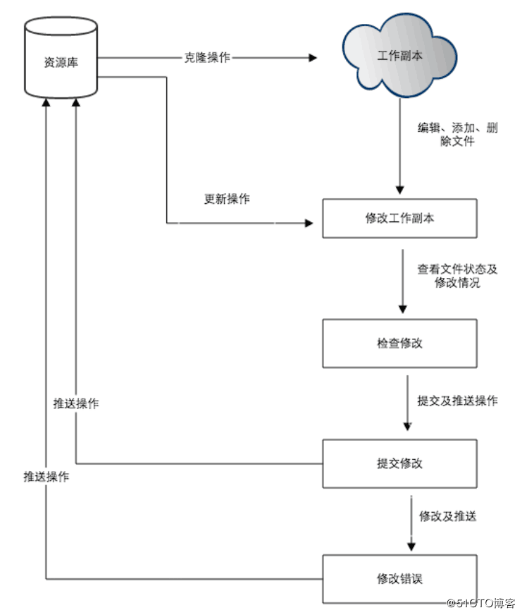

git的工作流
--------------
::

	你的本地仓库由git维护的三颗"树"组成
	第一个是你的工作目录(workspace)，位于PC上，它持有实际的文件
	第二个是暂存区（index），它像个缓存区域，临时保存你的改动
	第三个是HEAD，它指向你最后一次提交的结果
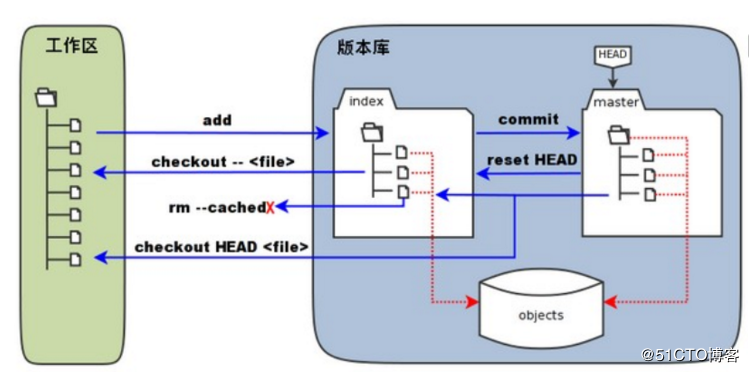

git的简单命令
--------------
git commit(提交代码)
-------------------
::

	步骤：
		1.git add 文件名
		2.git commit -m "提交的信息"
		
- 提交代码的时候可能会误操作了以下几点：
	+ 1.忘记了提交某个文件
	
	+ 2.想把两个commit合并
	
	+ 3.commit的信息写错了

- 忘记了提交某个文件
	+ git add test
	
	+ git commit -m "add test"
	
	+ git add a
	
	+ git commit --amend

- 想把两个commit合并
	git rebase -i commitid

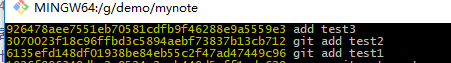
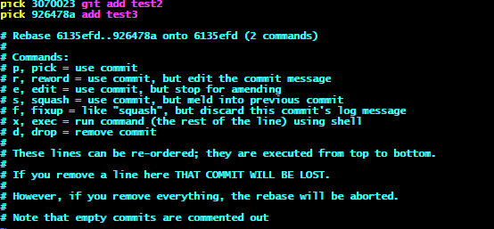
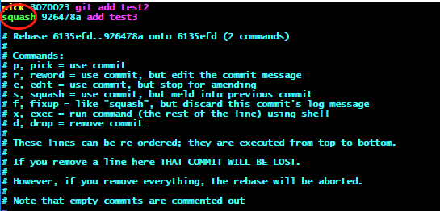
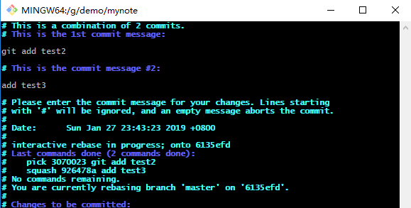
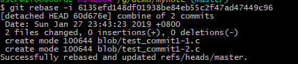

- commit的信息写错了
	git commit --amend
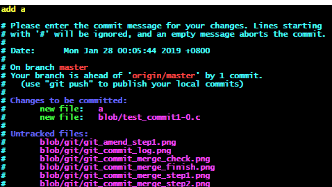
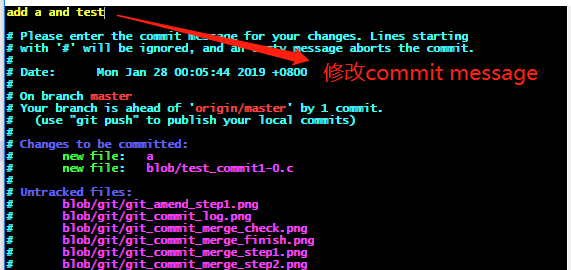
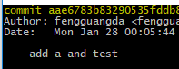

git checkout / git reset HEAD (撤销文件)
-------------------------------------------
- 如果是已经git add 文件到了暂存区，那么我们需要git reset HEAD 文件名
- 如果还在本地，那么我们可以 git checkout -- 文件名

git log (查看历史)
-------------------	
::

	在提交了若干个更新，或者clone了一个新的项目，
	好奇想看这个项目某个时间段做了什么，想回顾提交的历史，
	那么就需要查看提交的Log
	
- 查看提交历史 git log
	默认不加参数，git会按照提交时间列出所有的更新，最近更新的会放在最前面

- git log添加选项 --pretty
	这个选项可以使用不同的默认格式来展示提交历史
	git log --pretty=oneline	
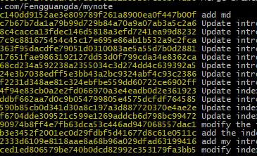

git checkout 分支名字/git checkout -b 分支名字 （分支管理）	
-----------------------------------------------------------
::
 
	如果在工作过程中，想要对某个问题进行追踪，又不想影响到主分支的行为
	那么可以新建分支并在对应分支上进行修改
	修改后进行测试，确保修改是正确的，那么可以将其合并到你的master分支来部署在线上

- 新建分支: git checkout -b test
	相当于git branch test + git checkout test

- 合并分支: git merge 
	git checkout master git merge test

- 删除分支: git branch -d
	git branch -d test

git stash save /git stash pop (储藏和释放数据)
-----------------------------------------------
::

	有时候,当你的项目的一部分上已经工作一段时间，看起来所有东西都很混乱。
	这个时候突然接到一个任务，想要在以前代码的基础上进行功能开发
	但是你代码已经写了一部分，没必要把现在的进度commit或者reset掉从头开始
	问题的答案在于:git stash命令
	stash命令会处理掉当前工作任务的脏的状态：把你现在修改的跟踪文件和暂存
	并且将所有的修改都保存在栈上，这个时候可以开始你的表演了

- 储藏: git stash
	将当前所有的修改都进行压栈处理
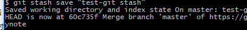

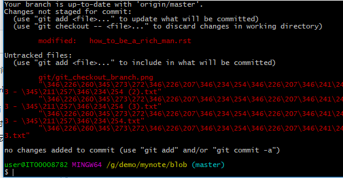

- 释放: git pop
	将压栈的数据进行弹栈
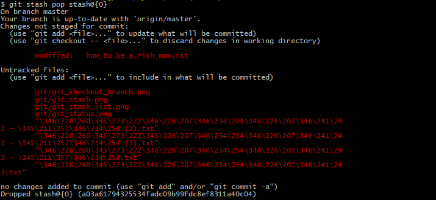

git tag (标签)
---------------
::

	在做项目的时候，我们都会有V1.0，V1.1，V1.2诸如此类
	那么我们发布版本的时候，就可以对当前状态进行打标签
	git 中使用的标签有两种，轻量级的和含附注的。
	轻量级标签就像是一个不会变化的分支，实际上它就是一个指向特定提交对象的引用
	而含附注标签，实际上是仓储在仓库中的一个独立对象，它有自身的校验和信息，
	包含着标签的名字，电子邮件地址和日期，以及标签说明
	我们一般用的是含附注的标签，以便保留相关信息。
	
	注意事项:
	标签总是和某个commit挂钩。如果这个commit既出现在master分支，又出现在dev分支，那么在这两个分支上都可以看到这个标签。
	新建标签默认为HEAD,如果想要对过去的提交打标签，需要指定对应的commit ID
	
- 在HEAD 新建标签
	git tag <tagname>
	git tag -a <tagname> -m "add tag"

- 对过去的提交打标签
	git tag -a <tagname> commitid -m "add"
	
- 删除标签
	git tag -d <tagname>

- 列出已有的标签
	git tag
	git show
	git show <tagname>

git revert (版本回退)
-----------------------
::
	
	当我们已经把我们的commit推送到远程服务器的时候，此时我们想要回退版本,
	并且要求这个版本的内容和回退的版本内容一致，但是HEAD指针是指向这个新生
	成的版本，而不是目标版本。这个时候需要进行revert(反转)一下
	
	适用场景：
		如果想要恢复之前的某一版本，但是又想保留该目标版本后面的版本，并且
	记录下来整个版本的变动过程。
	
	比较：
		1.git reset  恢复之前某个提交的版本，并且版本之后的所有提交都不要了
		2.git revert 适用于保留版本变动
	
- 查看提交历史
	git log
	
- 反转版本
	使用“git revert -n 反转版本，并使用“git commit -m 版本名”提交
	
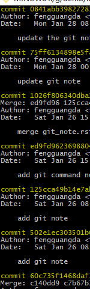
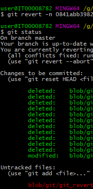